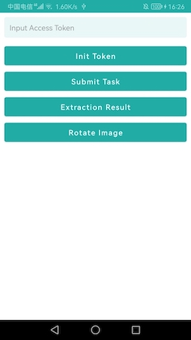

# 6Estates Intelligent Document Platform（IDP) - Android Demo App

An android demo app of integrating 6Estates idp-android SDK

## Download APK

## Function

1. Enter a token to initialize

   

2. Select a PDF to submit

   

3. Select multiple pictures to submit,and crop picture

   

4. Get the extraction result in Json or excel,and Send Excel to email

   

5. Rotate image

   
  

